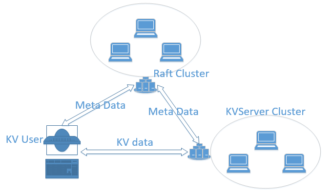

这是一个基于raft协议的分布式内存KV数据库

整个集群的结构如下图所示.由Raft集群去维持Server集群的元信息.KV的Client向Raft集群查询元信息,并获得不同Server的ip:port以及shard.根据元信息向相应的server请求服务.

整个系统的结构参考了zookeeper+kafka的实现结构.



Raft Cluster提供了一套Api,使得User可以向Raft Cluster中注册服务.Api分为主动调用以及回调两种.

不同于zookeeper提供树形层次结构的抽象,该系统中的Api基于数组的抽象.主要的使用是用

```
void setSlot(int index, String infomation)
```

这一Api完成集群中元数据的存储.


1. Api详细介绍

   1.1主动调用Api

   ```
   提供给客户端集群选择leader的Api,epoch大的调用发起者将成为客户端集群的leader
   void electLeader(int epoch);
   在相应的位置放置信息,目前源信息的格式只支持String
   void setSlot(int idx,String ADDRESS);
   查询现在各个Slot中存放的信息
   ArrayList<String> getCurrentSlot();
   查询由Raft Cluster感知到的Rafet Client集群中存活的机器
   ArrayList<String> getCurrentAlive();
   ```

   1.2回调Api

   回调Api需要实现RaftCallBack接口,并向RaftClient中注册自己.这样当相应的时间发生时RaftClient便会调用相应的回调函数

   ```
   RaftClient raftClient = new RaftClient(raftCallBack);
   ```

   ```
   public interface RaftCallBack {
   	当eleclLeader(int epoch)调用选择leader成功后调用的回调
       void onBecomeLeader(RaftClientImp raftClientImp);
       当eleclLeader(int epoch)调用选择leader失败后调用的回调
       void onLeaderFailed(int epoch);
       当前的leader从Raft CLuster离开时调用的回调
       void onSelectLeaderFailed(RaftClientImp raftClientImp);
       当集群中有新的Member加入时调用的回调
       void onMemberJoin(int idx,String address);
       当集群中存活的Member离开时调用的回调
       void onMemberLeave(String address);
   }
   ```

2. 配置文件介绍

   2.1 RaftServer配置文件

   整个Raft Cluster的底层基于JGroups的广播实现.因此对于Raft Server这边只需要指明自己的,Ip以及向外提供服务的端口.同时需要指出整个集群的大小,因为Raft需要得到多数member的同一才能进行commit.

   ```
   <?xml version="1.0" encoding="UTF-8"?>
   <host>
       <ip>127.0.0.1:50000</ip>
       <clusterSize>3</clusterSize>
   </host>
   ```

   2.2 Raft Client配置文件

   对于Raft集群的Client需要指出每个Raft服务器的Ip以及提供服务的端口

   ```
   <?xml version="1.0" encoding="UTF-8"?>
   <hosts>
       <host>
           <ip>127.0.0.1:50000</ip>
           <ip>127.0.0.1:50001</ip>
           <ip>127.0.0.1:50002</ip>
       </host>
   </hosts>
   ```

3. 使用方式
须在Ubuntu下运行.
下载工程后,来到FastTest文件夹下,运行start.sh脚本会依次启动cluster size为2的Raft Server以及shard为2的KV Server.
之后根据命令行的提示便可以作为KV的Client进行读或者写数据库.
使用完毕后,按下CTRL+C可以突出程序,同时脚本会自动kill掉刚才启动的Raft Sever以及KV Server.